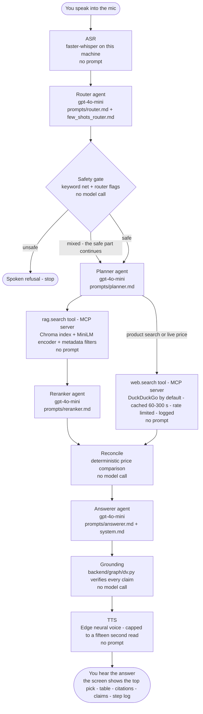

# DiscoveryVoice - Voice-to-Voice Product Discovery

An AI shopping assistant that listens to a spoken product request - searches a private Amazon Product Dataset 2020 catalog (Home & Kitchen slice) and live web data - and answers out loud with cited side-by-side recommendations.

Fully self-contained: everything runs from this repository. Clone it - install - run. The screen is React with Tailwind - the brain is FastAPI with a LangGraph pipeline - the two retrieval tools live behind an MCP server - speech runs locally.

 - launch the whole system with checks and a public link

 - run the nineteen-measure evaluation

## What it does

1. Voice or text input - a mic recording is transcribed by Whisper on this machine - or type the request
2. Router - extracts intent and constraints (budget - brand - material - eco) plus safety flags and whether live data is needed
3. Safety - a deterministic keyword net runs before any model call and blocks unsafe chemical requests. A mixed request gets its safe part answered with an explicit refusal of the unsafe part
4. Planner - decides the tools: rag.search always - web.search only when freshness is needed
5. rag.search - hybrid retrieval over the private catalog: metadata filters (price - category - material - eco) plus semantic ranking with a rerank step. Returns ranked products with doc_id for citations
6. web.search - live price and availability from known shopping sites with a short cache and a per-minute cap
7. Reconcile - matches the top catalog pick to the best web result and flags price differences above fifteen percent
8. Answerer - writes a short spoken answer with inline [n] markers - a claims list - and citations. A grounding layer then verifies every claim against the retrieved data - drops what it cannot verify - renumbers the markers - and a post-processor caps the answer at sixty words ending with a question
9. Speak - the answer is synthesized to audio (markers stripped - fifteen second cap) and played back

## Architecture - one voice turn as a flowchart

GitHub renders the diagram below. Every box names the stage - the model it calls - and the prompt file it uses. The chat model is one setting (LLM_MODEL - default gpt-4o-mini).

## The agents - what each does and what its prompt says

One chat model runs every agent (LLM_MODEL - default gpt-4o-mini). Every prompt is a plain markdown file in the prompts folder and is loaded at run time. The summaries below state what each prompt instructs.

**System prompt - prompts/system.md** - prepended to every agent call:

- ground every claim only in the provided catalog rows (by doc_id) or live results (by url) - never invent products or prices or ratings
- say when evidence is missing instead of guessing
- never give unsafe chemical advice
- keep the screen answer within sixty words - return strictly the requested JSON

**Router - prompts/router.md + prompts/few_shots_router.md** - turns the transcript into structure. The prompt instructs it to extract: intent (product_search | price_check | general_question) - constraints (budget with number words converted to numbers - material - brand - category - eco flag) - safety_flags for unsafe chemical requests - freshness_needed and needs_live for current price or stock wording - and permissible_query (the safe part of a mixed request). The few-shot file shows worked examples of the exact output shape.

**Planner - prompts/planner.md** - picks the tools and the filters. The prompt instructs: always include rag.search - add web.search when live data is needed or the intent is a product search or a price check - map the constraints into retrieval filters (category - max_price - material - eco_friendly) - and choose three to five comparison criteria.

**Reranker - prompts/reranker.md** - orders the retrieved candidates. The prompt instructs: rank the top three doc_ids by relevance against the criteria - use only doc_ids that appear in the candidate list - ignore null fields rather than inventing values - and give a one or two sentence rationale.

**Answerer - prompts/answerer.md** - writes the final answer. The prompt instructs: open with the total option count and cite every option once with [n] markers - list one claim object per factual statement (claim - source_type - doc_id plus field for catalog - web_url plus web_title for the web) - name the top pick with its price and fill a one-line top_pick_reason - answer stock and price questions first and explicitly from the live results - include the sentence "I've sent details and sources to your screen." - mention any catalog-versus-live discrepancy - at most sixty words ending by asking whether they want the most affordable option or the highest rated one.

Not agents (no model call): the safety gate (a deterministic keyword net) - reconcile (a deterministic price comparison) - grounding (backend/graph/dv.py verifies every claim against the retrieved data and renumbers the markers).

## What is inside and where

| What | Where |
|---|---|
| Voice in and voice out | backend/speech (Whisper + Edge voices) - /api/transcribe - /api/speak - the mic and player in src |
| Agentic pipeline with steps | backend/graph (router - safety - planner - retrieve - rerank - reconcile - answerer) - every step logged with its input and output |
| Exactly two tools over MCP | backend/mcp_server - JSON-RPC server exposing rag.search and web.search with discovery and schemas and a cache and a rate limit |
| Private catalog retrieval | backend/rag (ingest - Chroma index - hybrid search with filters) |
| Live web with reconciliation | the web.search tool plus the reconcile step with discrepancy flags |
| Grounded answers with citations | claims + citations in every answer - backend/graph/dv.py verifies them programmatically |
| Safety | the deterministic keyword net before any model call plus the router flags plus the mixed-request policy |
| Model agnostic | LLM_PROVIDER and LLM_MODEL and EMBEDDINGS_PROVIDER env settings - openai or anthropic or google or ollama or the offline mock |
| Prompt disclosure | the prompts folder - every model instruction the pipeline uses as plain markdown |
| Evaluation | backend/app/evaluation.py - nineteen measures against targets - the in-app page at /evaluation - the notebook in evaluation/ |

## The screen

Conversation turns with the spoken answer and a play button - a top pick card - a comparison table of all matches - grouped citations (catalog + live web) - a claims breakdown linking every statement to its source - an agent step log - recent-search chips - a catalog browser with product pages - history and export.

## Evaluation

The harness runs the real pipeline over a graded case suite and reports nineteen measures against fixed targets (ASR WER and CER - router accuracy and macro F1 and constraint extraction - Precision at 3 and Recall at 3 and 8 and 20 and MRR and NDCG at 3 - hybrid filter compliance - answer faithfulness and relevance - latency budgets - case accuracy - index integrity - reconciliation coverage - provenance). Three ways to run it: the /evaluation page in the app - the evaluation notebook - or POST /api/evaluate.

evaluation/EVALUATION_ANALYSIS.txt lists each failing measure and the code change that fixed it (the safety keyword net - the grounding layer with the top-pick fallback - the freshness fallback - the soft filter ladder - the sixty-word question-ending cap - the WER normalization). A ProofAgent behavior exam is built into the evaluation notebook and runs when its secrets exist.

## Environment settings

| Variable | Meaning | Default |
|---|---|---|
| OPENAI_API_KEY | the model key for real runs | - |
| LLM_PROVIDER | openai - anthropic - google_genai - ollama - mock | openai |
| LLM_MODEL | the chat model | gpt-4o-mini |
| EMBEDDINGS_PROVIDER | local (MiniLM) - openai - hash (test) | local |
| ASR_PROVIDER | local (faster-whisper) | local |
| TTS_PROVIDER | edge | edge |

## Notes and limitations

- the dataset carries no ratings or reviews in this slice so those fields stay empty and the answerer says a value is unavailable rather than inventing it
- the web cache is in-memory per process - intentional for a demo
- the faithfulness and relevance judges are themselves models - treat their scores as strong signal rather than ground truth
